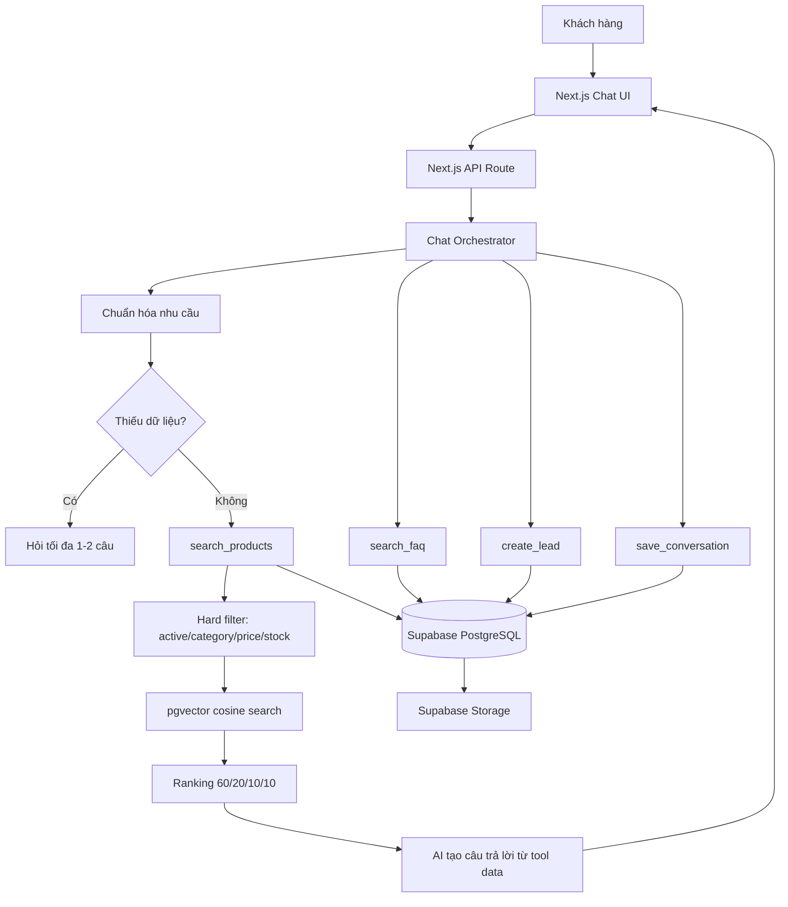

# AI Sales Advisor — MVP Blueprint

## 1. Cách hiểu dự án

Đây là MVP trình diễn cho cuộc thi: khách hàng trò chuyện bằng tiếng Việt, hệ thống chuẩn hóa nhu cầu, tìm tối đa ba sản phẩm từ dữ liệu Supabase, giải thích lý do đề xuất, hỗ trợ so sánh/FAQ và chuyển nhu cầu thành lead. AI chỉ dùng dữ liệu do các tool trả về, không được truy cập database trực tiếp hay tự bịa giá, tồn kho và chính sách.

Repo hiện có dữ liệu FMCG thật, vì vậy bản demo trước mắt dùng Milo, Nescafé, Maggi, Bibica và các sản phẩm bách hóa. Kiến trúc không khóa theo ngành; thay seed/catalog là có thể chuyển sang điện tử.

## 2. Phạm vi MVP đã chốt

- Chat UI responsive, typing state, câu hỏi gợi ý và product cards.
- Tối đa 1–2 câu làm rõ; tối đa 3 sản phẩm mỗi lượt đề xuất.
- Hybrid retrieval: hard filter trước, vector similarity sau, xếp hạng bằng công thức giải thích được.
- Product detail, compare, FAQ, lead form và lưu conversation.
- Admin tối giản: products CRUD/CSV, leads, conversations, FAQ.
- Một ứng dụng Next.js App Router; Supabase cho Postgres/Auth/Storage/pgvector.
- Không multi-tenant, billing, omnichannel, microservice, Redis, queue hay analytics nâng cao.

## 3. Cấu trúc thư mục đích

```text
src/
  app/
    (customer)/page.tsx
    admin/{products,leads,conversations,faq}/page.tsx
    api/chat/route.ts
    api/tools/{search-products,compare-products,create-lead}/route.ts
  components/{chat,products,admin,ui}/
  features/
    chat/{orchestrator,prompt,state}.ts
    catalog/{queries,ranking,schemas}.ts
    leads/{actions,schemas}.ts
  lib/
    ai/{provider,openai}.ts
    supabase/{client,server,admin}.ts
    env.ts
  types/database.ts
supabase/
  migrations/
  seed.sql
docs/
```

## 4. Luồng hệ thống



## 5. Database Supabase

Migration `001_initial_mvp.sql` tạo `products`, `faq_documents`, `conversations`, `messages`, `leads`; `auth.users` được dùng trực tiếp cho admin. Vector có 1536 chiều, HNSW cosine index, partial indexes cho catalog đang hoạt động, indexes trên khóa ngoại và cột filter. RLS cho phép đọc catalog/FAQ công khai, ghi conversation/lead qua API, và chỉ admin đã xác thực được quản trị.

RPC `match_products` nhận embedding cùng filter category/price/stock, sau đó trả về similarity và `final_score`:

```text
similarity × 0.60 + budget_score × 0.20 + stock_score × 0.10 + featured_score × 0.10
```

## 6. Kế hoạch 5 milestone

1. **Khởi tạo:** TypeScript, Tailwind/shadcn, Supabase clients, env validation, migration, RLS, seed.
2. **Product search:** embeddings, RPC, filter/ranking, search API và tests.
3. **Chatbot:** provider interface, OpenAI implementation, Zod tools, prompt, orchestrator, conversation persistence.
4. **Giao diện:** chat/product/compare/lead và admin CRUD/CSV/FAQ.
5. **Hoàn thiện demo:** loading/error, responsive, 5 kịch bản, README, deploy và nội dung thuyết trình.

## 7. Năm kịch bản demo

1. Nhu cầu rõ: “Combo Milo và cà phê dưới 300.000đ”.
2. Nhu cầu thiếu: “Tôi muốn mua đồ uống” → hỏi đối tượng và ngân sách.
3. So sánh hai sản phẩm đã được đề xuất.
4. Hỏi chính sách giao 2H/đổi trả → chỉ trả lời từ FAQ.
5. Xin tư vấn thêm → thu tên, số điện thoại và tạo lead.
